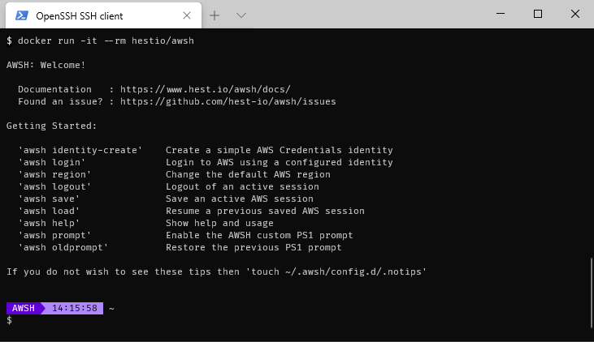

# AWSH: AWesome SHell for Cloud

[](https://github.com/hest-io/awsh/blob/master/LICENSE)
[](http://worx.docs.hest.io/awsh/)
[](https://hub.docker.com/r/hestio/awsh)

## What is AWSH?



- Lightweight containerized Shell with AWS tools inside
- Aimed at providing a shell equivalent for AWS Console
- Login to AWS, Assume Roles, Switch AWS Accounts and Regions with ease
- Great for users, developers and organisations that have to work with many AWS Accounts


## Docker by default

The preferred method of installing and using AWSH is now a Docker container based version that brings you all that you need to run and use AWSH without disrupting your normal OS package setup.

This should make it easier for you to use the latest version and make it easier to rollback an update if a new version breaks something you relied on


## Get and use AWSH

### Basic Usage

- From your command line pull and run the latest AWSH image

    ```console
    $ docker run -it --rm hestio/awsh
    ```

### Use AWSH with persistent identities

- Create a path to store your AWSH identities

    ```console
    $ mkdir -p ${HOME}/.awsh
    ```

- Run the AWSH container, passing in your AWSH identities

    ```console
    $ docker run \
        -it \
        --network=host \
        -v ${HOME}/.awsh:/home/awsh/.awsh \
        -v ${HOME}:/workspace \
        -v /tmp:/tmp \
        hestio/awsh
    ```

### Use AWSH with persistent identities, workspace, proxy config and Active Directory/Kerberos credentials

- Create a path to store your AWSH identities

    ```console
    $ mkdir -p ${HOME}/.awsh
    ```

- Run the AWSH container, passing in your AWSH identities and your Kerberos setup and your proxy environment

    ```console
    $ docker run \
        -it \
        --network=host \
        -v ${HOME}/.awsh:/home/awsh/.awsh \
        -v /etc/krb5.conf:/etc/krb5.conf \
        -v /etc/krb5.conf.d/:/etc/krb5.conf.d/ \
        -v ${HOME}:/workspace \
        -v /tmp:/tmp \
        -e "http_proxy=${http_proxy}" \
        -e "https_proxy=${https_proxy}" \
        -e "no_proxy=${no_proxy}" \
        -e "KRB5CCNAME=${KRB5CCNAME}" \
        hestio/awsh
    ```

### Create a wrapper script to allow AWSH to be used as a Shell

- Create the wrapper script `/usr/local/bin/awsh`

    ```bash
    #!/bin/bash

    PUID=$(id -u)
    PGID=$(id -g)

    [ -d ${HOME}/.awsh ] || mkdir -p ${HOME}/.awsh

    docker run \
        -it \
        --rm \
        --network=host \
        --user ${PUID}:${PGID} \
        -v ${HOME}/.awsh:/home/awsh/.awsh \
        -v /etc/krb5.conf:/etc/krb5.conf \
        -v /etc/krb5.conf.d/:/etc/krb5.conf.d/ \
        -v ${HOME}/workspace:/home/awsh/workspace \
        -v /tmp:/tmp \
        -e "HOME=/home/awsh" \
        -e "PUID=${PUID}" \
        -e "PGID=${PGID}" \
        -e "http_proxy=${http_proxy}" \
        -e "https_proxy=${https_proxy}" \
        -e "no_proxy=${no_proxy}" \
        -e "KRB5CCNAME=${KRB5CCNAME}" \
        hestio/awsh
    ```

- Make the wrapper executable

    ```console
    sudo chmod a+x /usr/local/bin/awsh
    ```

- Start the wrapper script normally

    ```console
    awsh
    ```
