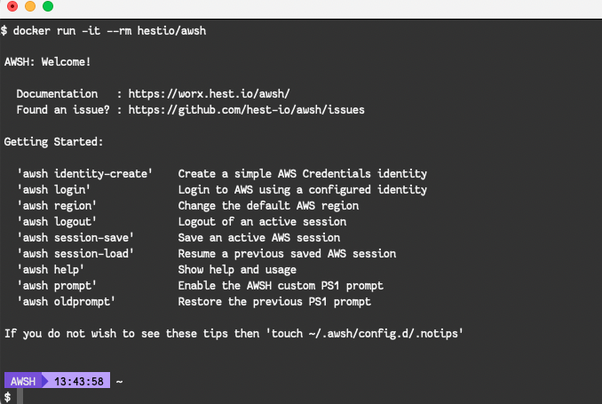

{!hestio-header.md!}

# Getting Started with AWSH

## Who is AWSH for?

Anyone who wants their CLI experience to be more like the AWS Console

| Who? | Why? |
|---|---|
| AWS Partners,<br/> AWS Professionals,<br/> Managed Service Providers | Teams who have to access and manage multiple AWS Accounts |
| AWS Users,<br/> AWS Developers,<br/> AWS Admins | Teams who manage access using multiple Roles within AWS Accounts |
| Enterprises | Teams required to use corporate identity management (ADFS, IDP, Auth0, OAuth2, Okta) in order to access external services such as AWS |

You can of course use **AWSH** if it's just to manage your own personal AWS account. There's lots of useful tools included so why not [check them out](/user-guide/auth-setup/) and decide for yourself!

## Make the CLI experience more like the AWS Console

When we begin our journey on AWS in most cases we start out with a set of simple plain-text API credentials, in the form of `aws_access_key_id` and `aws_secret_access_key`. 

Depending on where you work and who you work for though it's more likely that if you are accessing AWS on behalf of your company that your access to the AWS API is secured behind at least one layer of security

**Web Based Experience (AWS Console)**

If you're using the AWS Console then accessing AWS using your corporate identify is often only a matter of several clicks


**CLI Based Experience**

The experience for CLI users is not as seamless though when you need to use your company directory or access controls to access AWS. There are often many obstacles to using the CLI, some of which can be;

- **Enterprise Identity Providers** (Active Directory, Azure AD Native, G Suite, LDAP, PingFederate)
- **Corporate web proxies** (transparent, PAC based, authenticated)


**AWSH** attempts to bridge that gap and provide the same experience at the CLI that we're all accustomed to in the Web Browser


## What do I need?

If you already have Docker installed you are ready to go!

```console
docker run -it --rm hestio/awsh
```




Once you've got your shell working you can hop over to the **[User Guide](/user-guide/auth-setup/)** to begin using some of the helpful tools inside as well as setup AWSH to use your local or corporate credentials to access AWS


## I need Docker first!

If you don't yet have Docker installed or access to Docker then you can follow the official documentation from the folks at Docker to find the right version for your operating system and get up and running

[https://docs.docker.com/get-docker/](https://docs.docker.com/get-docker/)


## What's in AWSH?

Some of the awsome things in here in addition to our own tools are;

- The **AWS CLI** [https://aws.amazon.com/cli](https://aws.amazon.com/cli/)
- **SAWS**: A supercharged AWS command line interface [https://github.com/donnemartin/saws](https://github.com/donnemartin/saws)
- **JQ**: Command-line JSON processor [http://stedolan.github.io/jq/](http://stedolan.github.io/jq/)
- **Python 3**: [https://www.python.org/] (https://www.python.org/)

!!! note "Coming Soon"
    The following are also in the works;

    - AWS Systems Manager Session Manager: [https://docs.aws.amazon.com/systems-manager/latest/userguide/session-manager.html](https://docs.aws.amazon.com/systems-manager/latest/userguide/session-manager.html})
    - AWS SAM CLI: CLI tool to build, test, debug, and deploy Serverless applications using AWS SAM [https://aws.amazon.com/serverless/sam/](https://aws.amazon.com/serverless/sam/)
